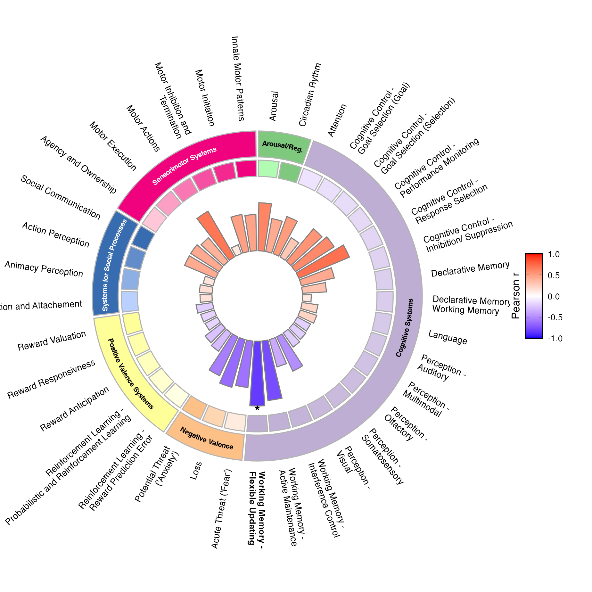
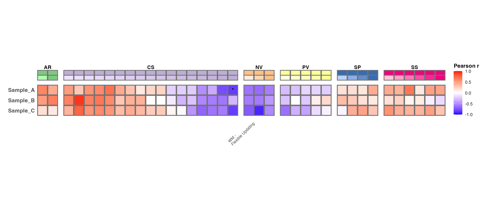
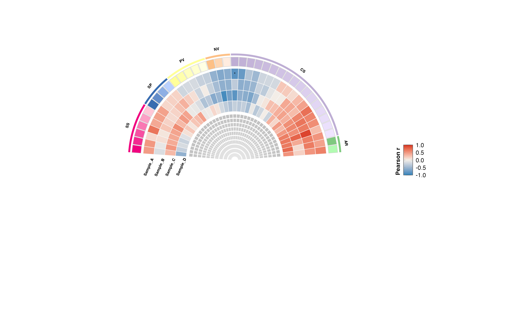

# rdocodeR

<p align="center">
  
</p>

`rdocodeR` is an R package for decoding brain overlays into the NIMH RDoC framework and visualizing term-level/domain-level results.

## What Is RDoC?

The Research Domain Criteria (RDoC) framework organizes brain-behavior findings by functional domains (for example Cognitive Systems, Valence Systems, and Arousal/Regulatory), rather than only by diagnosis.

## Installation

```r
install.packages("devtools")
devtools::install_github("alegiac95/rdocodeR")
```

## Quick Workflow

1. Decode your overlay with `rdoc_decode()`.
2. Plot one result with `rdoc_circleplot()`.
3. Compare multiple results with `rdoc_compare_heatplot()` or `rdoc_compare_fanplot()`.

---

## 1) Decode an Overlay

```r
library(rdocodeR)

res <- rdoc_decode(
  fs_overlay = your_overlay,
  perm_method = "eigen",   # default
  cor_method = "pearson"   # default
)

# Optional TSV export
rdoc_decode(
  fs_overlay = your_overlay,
  save_results = TRUE,
  results_file = "~/Desktop/rdoc_decode_results.tsv"
)
```

---

## 2) Plot a Single RDoC Decoding Table

```r
library(rdocodeR)

df <- rdoc_example_data()

p_circle <- rdoc_circleplot(
  corr_df = df,
  domain_palette = "Accent",
  show_term_labels = TRUE,
  highlight_significant_terms = TRUE,
  correlation_label = "pearson"
)
p_circle
```



---

## 3) Compare Multiple Decoding Tables (n >= 2)

### Heat-style comparison

```r
library(rdocodeR)

df1 <- rdoc_example_data()
df2 <- df1
df3 <- df1
set.seed(1)
df2$r <- pmax(pmin(df2$r + rnorm(nrow(df2), sd = 0.10), 1), -1)
df3$r <- pmax(pmin(df3$r + rnorm(nrow(df3), sd = 0.15), 1), -1)

p_heat <- rdoc_compare_heatplot(
  corr_list = list(Sample_A = df1, Sample_B = df2, Sample_C = df3),
  domain_palette = "Accent",
  show_significance_stars = TRUE,
  show_significant_term_labels = TRUE,
  correlation_label = "pearson"
)
p_heat
```



### Fan-style comparison

```r
library(rdocodeR)

p_fan <- rdoc_compare_fanplot(
  corr_list = list(Sample_A = df1, Sample_B = df2, Sample_C = df3),
  domain_palette = "Accent",
  show_significance_stars = TRUE,
  correlation_label = "pearson"
)
p_fan
```



The README plots above are generated from synthetic (fake) custom correlations built on the package term structure.

```r
terms <- rdoc_terms_reference()

make_fake <- function(seed, phase = 0) {
  set.seed(seed)
  x <- seq_len(nrow(terms))
  r <- 0.45 * sin(x / 4 + phase) + 0.25 * cos(x / 7 - phase) + rnorm(length(x), 0, 0.12)
  r <- pmax(-1, pmin(1, r))
  p <- pmin(1, exp(-4.0 * abs(r)) + runif(length(x), 0, 0.06))
  p <- pmax(p, 1e-4)
  data.frame(Domain = terms$Domain, Term = terms$Term, r = r, p = p)
}

df1 <- make_fake(1001, 0.0)
df2 <- make_fake(1002, 0.4)
df3 <- make_fake(1003, -0.3)
```

---

## Standalone Helpers

- `rdoc_available_palettes()` to inspect palette options
- `plot_rdoc_legend()` for circular-term legends
- `plot_rdoc_heatmap_legend()` for heatplot term annotation legend
- `rdoc_terms_reference()` and `rdoc_terms_file()` for internal term resources

---

## Backward Compatibility

Old function names are still available as wrappers:

- `plot_rdoc_gg()` and `plot_rdoc()` -> `rdoc_circleplot()`
- `plot_rdoc_compare_heatmap()` and `plot_rdoc_heatmap_compare()` -> `rdoc_compare_heatplot()`
- `plot_rdoc_compare_semicircle()` -> `rdoc_compare_fanplot()`
